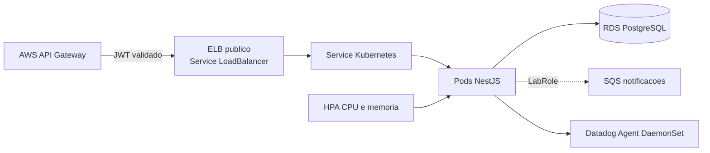

# Oficina API

Aplicação principal do Tech Challenge 3. Este repositório mantém o backend NestJS, o modelo Prisma, as migrações, a imagem OCI e o chart Helm executado no Amazon EKS. A autenticação de clientes por CPF é emitida pelo repositório `oficina-auth-serverless`; o login de operadores por e-mail e senha permanece disponível.

## Arquitetura deste repositório

> Executado no **AWS Academy Learner Lab** — ver `docs/adr/` para as decisões e limitações.



O API Gateway e as Lambdas ficam em `oficina-auth-serverless`; VPC/EKS/ECR/Datadog Agent em `oficina-infra-kubernetes`; RDS e o secret de conexão em `oficina-infra-database`. Sem ALB interno / VPC Link / IRSA / External Secrets Operator (indisponíveis no Learner Lab): o ingress é um `Service type: LoadBalancer` público e o Secret da aplicação é criado pelo pipeline a partir do Secrets Manager.

## Tecnologias

- Node.js 22, NestJS 11 e TypeScript
- Prisma ORM e PostgreSQL
- JWT/Passport e Swagger/OpenAPI
- Jest e Testcontainers
- Docker/OCI e Helm/Kubernetes
- Datadog APM (`dd-trace`), DogStatsD, logs JSON e Unified Service Tagging
- GitHub Actions (credenciais de sessão do AWS Academy)

## Execução local

Requisitos: Node.js 22, npm e Docker.

```bash
cp .env.example .env
docker compose up -d db
npm ci
npx prisma migrate deploy
npm run seed
npm run start:dev
```

A API fica em `http://localhost:3000/api`. Os endpoints de saúde são:

- `GET /api/health/live`: processo disponível.
- `GET /api/health/ready`: processo e PostgreSQL disponíveis.

O valor de `JWT_SECRET` local deve ser igual ao usado pela função serverless para validar tokens de clientes. Nunca envie `.env`, tokens, CPF, connection strings ou chaves Datadog ao Git.

## APIs e coleções

- Swagger local: `http://localhost:3000/api/docs`
- Postman: [`postman/oficina-api.postman_collection.json`](postman/oficina-api.postman_collection.json)
- Contrato da autenticação por CPF: `../oficina-auth-serverless/openapi.yaml`
- Swagger homologação: `https://SUBSTITUIR_HOST_HOMOLOG/api/docs`
- Swagger produção: `https://SUBSTITUIR_HOST_PRODUCAO/api/docs`

Os dois últimos links são marcadores deliberados: devem ser substituídos somente após os endpoints existirem.

## Autenticação

O `JwtStrategy` aceita dois tipos de access token HS256, sempre com `iss=oficina-auth-serverless` e `aud=oficina-api`:

- `token_use=client`: emitido pela Lambda após validar CPF, cliente existente e ativo. O backend consulta novamente o cliente, aplica o papel `CLIENTE` e limita acesso às próprias ordens.
- `token_use=operator`: emitido pelo login legado para administrador, consultor técnico ou mecânico.

Tokens expirados, clientes/usuários inativos e assinatura, issuer ou audience inválidos são rejeitados. CPF não é incluído no JWT nem nos logs.

## Observabilidade Datadog

O processo inicia o tracer antes do Nest (`node --require dd-trace/init`). Todos os logs são JSON e incluem `correlation_id`, `dd.trace_id` e `dd.span_id` quando houver span ativo. O header `X-Correlation-Id` é validado ou criado e devolvido ao chamador.

Métricas DogStatsD emitidas:

| Métrica | Finalidade |
|---|---|
| `oficina.api.request.duration_ms` | Distribuição de latência HTTP |
| `oficina.service_orders.created` | Volume de ordens abertas |
| `oficina.service_orders.status_transition` | Transições por status |
| `oficina.service_orders.status_duration_ms` | Tempo em diagnóstico, execução e finalização |
| `oficina.service_orders.processing_errors` | Falhas no processamento de ordens |
| `oficina.integrations.errors` | Erros de webhook/integrações |

O histórico relacional da ordem persiste `statusAnterior`, `statusNovo` e timestamp. A aplicação calcula a duração ao deixar um status e a envia como distribuição, evitando estimativas com base apenas no estado atual.

## Qualidade

```bash
npm run format:check
npm run lint
npm run test:cov -- --runInBand
npm run test:e2e
npm run build
docker build -t oficina-api:local .
```

A suíte herdada e ampliada contém testes unitários e E2E. O workflow `CI` executa formatação, lint, cobertura, build, E2E e build do container em Pull Requests.

## Deploy automático

`.github/workflows/deploy.yml` roda a cada merge em `main` (e via *workflow_dispatch*): build da imagem → ECR (`oficina-homolog-api:<sha>`), cria o Secret `oficina-api` a partir do AWS Secrets Manager, `helm upgrade --install --atomic --wait`. O chart roda `prisma migrate deploy` (hook), probes HTTP, PDB, HPA 2–8 réplicas e `Service type: LoadBalancer`.

**GitHub Secrets** (renovar a cada sessão do Learner Lab, ~4h): `AWS_ACCESS_KEY_ID`, `AWS_SECRET_ACCESS_KEY`, `AWS_SESSION_TOKEN`. Opcionais: `ADMIN_SEED_PASSWORD`, `ORCAMENTO_WEBHOOK_TOKEN`.

**GitHub Variables** (após os outros repos subirem): `NOTIFICATION_QUEUE_URL` (output de `oficina-auth-serverless`), `DATABASE_SECRET_ID` (default `oficina/homolog/database/connection`), `JWT_SECRET_ID` (default `oficina/homolog/jwt`), `DD_ENABLED`, `DD_SITE`, `CORS_ORIGIN`.

`ci.yml` (PR/push): formatação, lint, cobertura, build, E2E, `helm lint`/`template`, build do container (sem push) — não usa AWS.

## Proteção do repositório

`.github/settings.yml` descreve `main` e `homolog` sem push direto, com Pull Request, uma aprovação e checks `Quality`, `E2E` e `Container`. Aplicar essas regras no GitHub e confirmar o convite do usuário `soat-architecture`; arquivos locais não conseguem comprovar esse estado externo.

## Documentação da entrega

Toda a documentação compartilhada está centralizada em [`docs/`](docs/README.md): diagramas, RFCs, ADRs, modelo ER, runbooks, matriz de requisitos, roteiro do vídeo e conteúdo-base do PDF final. Os demais repositórios mantêm apenas o `README.md` obrigatório e apontam para esta pasta.

## Licença

MIT. Consulte [LICENSE](LICENSE).

