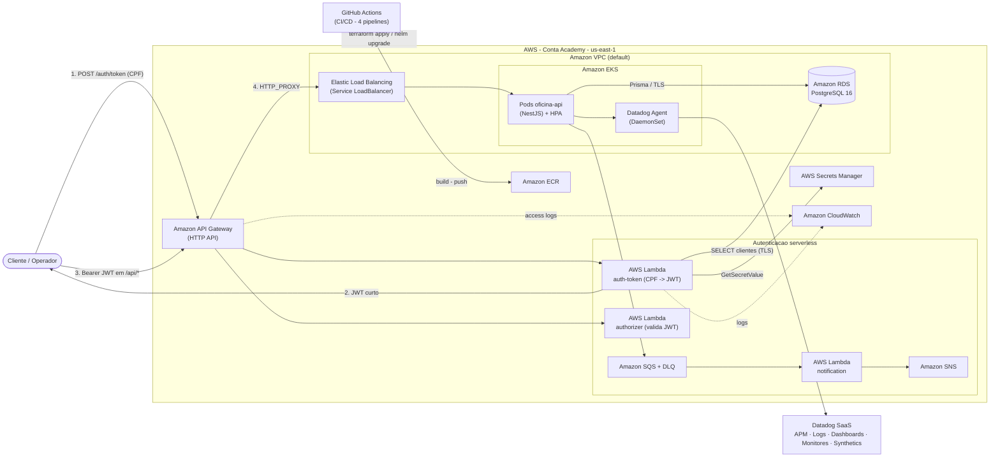
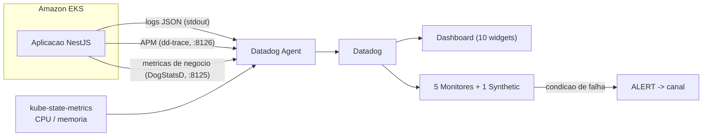

# Diagrama de arquitetura cloud (macro)

Diagrama macro focado em infraestrutura AWS. Para o PDF final, recriar em
draw.io / diagrams.net usando o conjunto de **ícones oficiais AWS 2024**
(File → New → template AWS), seguindo exatamente este fluxo.

## Fluxo principal

## Fluxo de observabilidade

## Notas para a versão com ícones AWS

| Bloco mermaid | Ícone AWS |
|---|---|
| API Gateway | *Amazon API Gateway* |
| Lambda x3 | *AWS Lambda* |
| SQS / SNS | *Amazon Simple Queue Service* / *Amazon Simple Notification Service* |
| Secrets Manager | *AWS Secrets Manager* |
| ECR | *Amazon Elastic Container Registry* |
| ELB | *Elastic Load Balancing* (Network/Classic LB) |
| EKS | *Amazon Elastic Kubernetes Service* |
| RDS | *Amazon RDS* (badge PostgreSQL) |
| CloudWatch | *Amazon CloudWatch* |
| VPC | *Amazon VPC* (moldura) |
| Datadog / GitHub | logos de terceiros (partner icons) |
