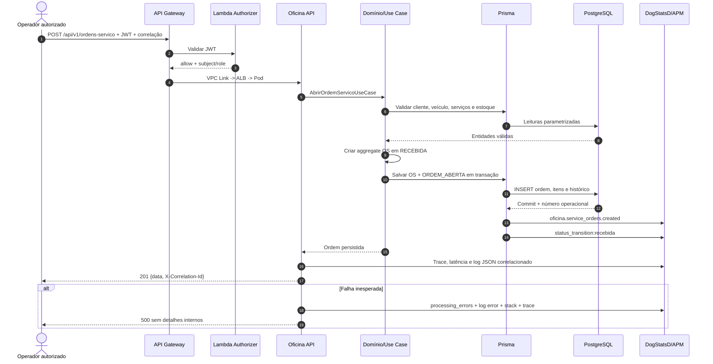

# Sequência de abertura de ordem de serviço

## Consistência

- A ordem e o primeiro evento de histórico são persistidos na mesma transação.
- O número operacional é gerado pelo PostgreSQL; o ID técnico usa ULID prefixado.
- Chaves estrangeiras preservam cliente, veículo, catálogo, orçamento, peças e histórico.
- Transições posteriores registram status anterior, status novo e timestamp. Ao sair de `EM_DIAGNOSTICO`, `EM_EXECUCAO` ou `FINALIZADA`, a duração é emitida ao Datadog.
- Falha de persistência não emite métrica de sucesso e incrementa o contador de processamento com baixa cardinalidade.

