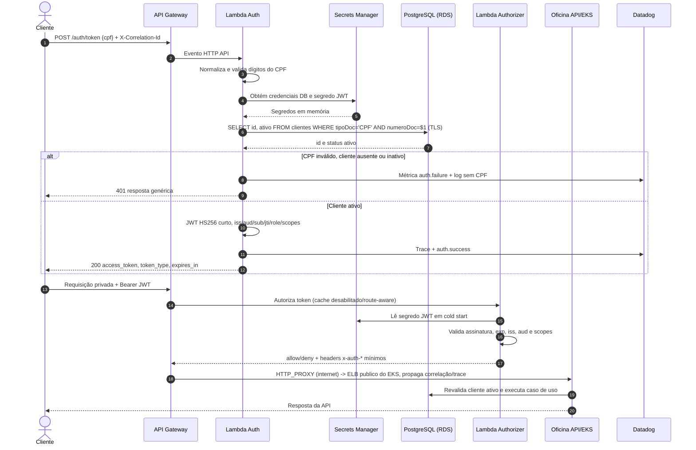

# Sequência de autenticação por CPF

## Regras

- Aceitar CPF com ou sem máscara, normalizar para 11 dígitos e rejeitar sequências repetidas/dígitos verificadores inválidos.
- A mesma resposta `401` é usada para CPF inválido, ausente ou inativo, reduzindo enumeração.
- Consultas são parametrizadas; o CPF nunca aparece em logs, tags Datadog ou JWT.
- Claims mínimas: `sub`/`client_id` interno, `role=CLIENTE`, `token_use=client`, `scopes`, `iss`, `aud`, `iat`, `exp` e `jti`.
- O backend faz defesa em profundidade: valida o token e consulta novamente o status do cliente.
- `X-Correlation-Id` e contexto de trace seguem Gateway, Lambdas e EKS.

## Limitação conhecida

O enunciado exige autenticação via CPF, mas CPF não é segredo. A solução aplica throttling no API Gateway, TTL curto e não exposição de PII; WAF e segundo fator (OTP) são evoluções recomendadas para produção real, sem alterar a interface do authorizer.

