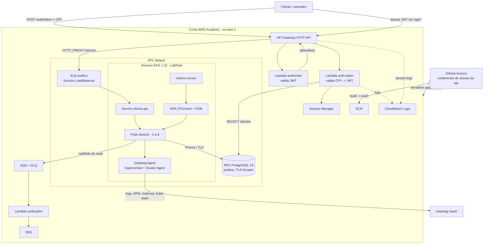

# Visão geral e diagrama de componentes

## Contexto

A solução mantém o domínio da oficina em um monólito modular NestJS e separa
código de aplicação, autenticação serverless, infraestrutura Kubernetes e
infraestrutura de banco em **quatro repositórios** com CI/CD independente.

O ambiente de execução é o **AWS Academy Learner Lab**. As decisões de adaptação
(LabRole, sem IRSA/OIDC, ingress público, RDS público) estão nas ADR-005 a
ADR-009. O desenho "corporativo" (ALB interno + VPC Link + IRSA + RDS Proxy +
integração AWS↔Datadog) permanece no histórico do Git e nas ADRs originais.

## Componentes (como implantado no AWS Academy)

## Fronteiras dos repositórios

| Repositório | Responsabilidade | Não possui |
|---|---|---|
| `oficina-infra-kubernetes` | VPC (default), EKS, node group, ECR, metrics-server, Datadog Agent, dashboard/monitores | Schema Prisma, RDS |
| `oficina-infra-database` | RDS PostgreSQL, SG, secret de conexão | Migrations do domínio |
| `oficina-auth-serverless` | API Gateway, 3 Lambdas (CPF→JWT, authorizer, notification), SQS/SNS | EKS, RDS, código NestJS |
| `oficina-api` | NestJS, Prisma/migrations, imagem, Helm, métricas/logs, documentação | Criação do cluster e do banco |

## Contratos entre repositórios

Cada repositório **planeja de forma independente** (usa a VPC default via data
sources). Os valores que atravessam repositórios entram como **GitHub Variables**
no momento do deploy, não por remote state:

| Contrato | Origem | Destino |
|---|---|---|
| `secret_arn` do banco | `oficina-infra-database` | `oficina-auth-serverless` (`DB_SECRET_ARN`), `oficina-api` (`DATABASE_SECRET_ID`) |
| secret `oficina/homolog/jwt` | criado manualmente no Secrets Manager | auth (`JWT_SECRET_ARN`) e app (`JWT_SECRET_ID`) |
| `notification_queue_url` | `oficina-auth-serverless` | `oficina-api` (`NOTIFICATION_QUEUE_URL`) |
| URL do ELB (`backend_url`) | `oficina-api` (deploy) | `oficina-auth-serverless` (`BACKEND_URL`), reaplica o API Gateway |
| `oficina/datadog` (api_key/app_key) | conta Datadog → Secrets Manager | pipeline de `oficina-infra-kubernetes` |

Ordem de deploy: `kubernetes → database → auth → app → (re-aplica auth) → observability`.
Detalhe em `docs/operacao/runbook-deploy-academy.md`.

## Disponibilidade e segurança

- 2 nós `t3.medium` em 2 AZs; mínimo de 2 pods, PDB, HPA 2–8.
- RDS com TLS obrigatório (`rds.force_ssl`), senha aleatória de 32 chars, sem
  dados reais (só massa de demonstração), destruído após a gravação.
- Rota `/api/{proxy+}` protegida pelo authorizer do API Gateway + revalidação
  no NestJS; `/api/health/*` e `/api/docs` públicos por design.
- JWT curto (5 min para cliente), respostas de auth genéricas (anti-enumeração),
  CPF fora de logs e do token.
- Segredos só no Secrets Manager; nunca em Git, imagem ou Terraform state.
