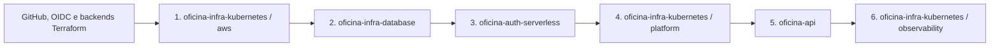

# Deploy, promoção e configuração externa

## Princípio

Os arquivos deste projeto preparam a entrega automática, mas não criam sozinhos conta AWS, organização GitHub, backend de estado, chaves Datadog, DNS nem aprovações. Esses itens são pré-requisitos externos e devem ser registrados como evidência, sem colocá-los no Git.

## Ordem de bootstrap



1. Criar quatro repositórios privados/públicos conforme a política da equipe, branches `main` e `homolog`, environments e papéis IAM OIDC.
2. Criar previamente o bucket S3 de state e a configuração de lock por ambiente. Os backends usam `use_lockfile`; não armazenar state local em CI.
3. Aplicar apenas o stack `aws` de `oficina-infra-kubernetes`. Guardar outputs de VPC, subnets, EKS, ECR, listener e target group.
4. Aplicar `oficina-infra-database` com os IDs anteriores. Guardar apenas ARNs/nomes e endpoints não secretos; senha permanece no Secrets Manager.
5. Aplicar `oficina-auth-serverless` com listener/VPC Link, subnets, SG, Proxy e segredo do banco. Registrar URL do Gateway, segredo JWT e ARN/URL da fila.
6. Aplicar o stack `platform` de Kubernetes com os ARNs de DB/JWT/Datadog e `notification_queue_arn`; registrar o output `application_irsa_role_arn`.
7. Executar o deploy de `oficina-api` com `NOTIFICATION_QUEUE_URL` e `APP_IRSA_ROLE_ARN`. O pipeline publica a imagem SHA, materializa ExternalSecrets, executa migrations e faz rollout Helm atômico.
8. Aplicar `observability`; após o smoke test emitir as métricas customizadas, habilitar `manage_metric_tag_configuration` em um único state Datadog.

## Ambientes e promoção

| Origem | Destino | Regra |
|---|---|---|
| feature branch | `homolog` | pull request obrigatório, checks verdes e revisão |
| `homolog` | homologação AWS | deploy automático após merge/push protegido |
| `homolog` | `main` | pull request obrigatório, checks verdes e revisão |
| `main` | produção AWS | deploy automático, com protection rule do GitHub Environment se adotada |

`main` e `homolog` não aceitam force-push ou exclusão. A configuração declarativa em `.github/settings.yml` serve como referência/automação por Settings/Probot; um administrador deve confirmar as regras na interface ou API do GitHub.

## Variáveis externas por repositório

Os nomes exatos também estão no README e nos workflows de cada repositório. A tabela é um inventário mínimo para configurar environments `homolog` e `production`.

| Repositório | GitHub Variables/inputs não sensíveis | Segredos externos |
|---|---|---|
| `oficina-infra-kubernetes` | `AWS_REGION`, `AWS_DEPLOY_ROLE_ARN`, backend/key, ambiente, domínio/URL de health | `DD_API_KEY`, `DD_APP_KEY` guardadas no serviço apropriado, nunca em `tfvars` versionado |
| `oficina-infra-database` | região, papel OIDC, backend/key, VPC, subnets e SGs permitidos | credencial gerada pelo Terraform no Secrets Manager |
| `oficina-auth-serverless` | região, papel OIDC, backend/key, listener ARN, subnets/SG, nomes dos segredos, issuer/audience | DB/JWT no Secrets Manager; webhook/integrações quando habilitados |
| `oficina-api` | `AWS_REGION`, `AWS_DEPLOY_ROLE_ARN`, `ECR_REPOSITORY`, `EKS_CLUSTER_NAME`, `API_TARGET_GROUP_ARN`, `DATABASE_SECRET_NAME`, `JWT_SECRET_NAME`, `NOTIFICATION_QUEUE_URL`, `APP_IRSA_ROLE_ARN`, `DEPLOY_RUNNER`, `CORS_ORIGIN`, `DD_SITE`, `APP_URL` | nenhum segredo AWS estático; pods recebem dados por External Secrets e permissão SQS por IRSA |

## Execução manual equivalente

Use os exemplos `.tfvars` de cada infraestrutura, copie-os para um arquivo não versionado e substitua todos os marcadores:

```bash
terraform fmt -check -recursive
terraform init -backend-config=backend.hcl
terraform validate
terraform plan -var-file=environments/homolog.tfvars -out=tfplan
terraform apply tfplan
```

Para a aplicação:

```bash
npm ci
npm run lint
npm run test:cov
npm run build
docker build -t oficina-api:local .
helm lint helm/oficina-api
```

Não use `-auto-approve` em uma estação sem revisão do plano. Em CI, a aprovação é a combinação de pull request protegido, environment e artefato de plan vinculado ao mesmo commit.

## Estratégia de mudança de banco

- Migrations devem ser aditivas/retrocompatíveis antes de remover coluna ou alterar contrato.
- O hook Helm executa `prisma migrate deploy` antes do rollout.
- Se uma migration falhar, o rollout é interrompido; não marque migration quebrada como aplicada.
- Mudança destrutiva usa expand/migrate/contract em releases separados.

## Rollback

### Aplicação

1. Identificar o último SHA saudável no ECR.
2. Executar `helm rollback oficina-api <REVISAO> --namespace oficina --wait` ou redeploy do SHA conhecido.
3. Confirmar probes, taxa de erro, traces e logs.
4. Não reverter migration de forma automática; aplicar migration corretiva compatível.

### Terraform

1. Reverter a alteração em pull request e gerar novo plan.
2. Revisar recursos com replacement ou destruição.
3. Aplicar somente após preservar snapshot/backup quando houver dado ou state envolvido.

### Banco

Restaurar snapshot/PITR em nova instância, validar dados e migrations e trocar o segredo/endpoint de modo controlado. Nunca sobrescrever produção sem cópia e plano de retorno.

## Evidências a guardar

- URLs dos quatro repositórios e SHA apresentado.
- Regras de proteção e convite de `soat-architecture` aceito/presente.
- Links dos workflows verdes de CI e deploy em homologação e produção.
- Plan/apply Terraform e outputs não sensíveis.
- URL do API Gateway, saúde, Swagger e versão implantada.
- Dashboard/monitores Datadog com janela temporal visível.
- Registro de rollback testado em homologação.

