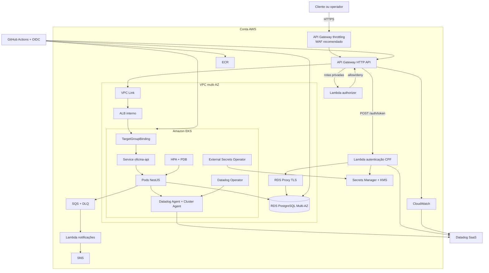

# Visão geral e diagrama de componentes

## Contexto

A solução mantém o domínio da oficina em um monólito modular NestJS, mas separa código de aplicação, autenticação serverless, infraestrutura Kubernetes e infraestrutura de banco em quatro ciclos de entrega independentes. A entrada pública é o AWS API Gateway; a aplicação e o banco permanecem em subnets privadas.

## Componentes

## Fronteiras dos repositórios

| Repositório | Responsabilidade | Não possui |
|---|---|---|
| `oficina-auth-serverless` | API Gateway, autenticação CPF, authorizer, notificação e IaC dessas funções | EKS, RDS e código NestJS |
| `oficina-infra-kubernetes` | VPC, EKS, ECR, ALB, add-ons, External Secrets, Datadog e observabilidade como código | Schema Prisma e RDS |
| `oficina-infra-database` | RDS PostgreSQL, Proxy, KMS, segredo, backups, logs e SG | Migrations do domínio |
| `oficina-api` | NestJS, Prisma/migrations, Docker, Helm, métricas e logs da aplicação | Criação do cluster e do banco |

## Contratos entre repositórios

1. A infraestrutura Kubernetes publica VPC ID, subnets privadas, SG cliente, cluster/ECR, listener ARN do ALB e target group ARN.
2. A infraestrutura de banco recebe VPC/subnets/SGs e publica endpoint, endpoint do Proxy, secret ARN/name e SG.
3. O serverless recebe subnets/SG/Proxy, listener ARN e segredo do banco; publica URL do API Gateway e segredo JWT compartilhado.
4. A aplicação recebe cluster/ECR, target group ARN e nomes dos segredos, então executa migration e rollout Helm.

Outputs não sensíveis podem ser transportados por Terraform remote state/SSM. Valores sensíveis ficam no Secrets Manager e são materializados no cluster pelo External Secrets Operator.

## Disponibilidade e segurança

- Subnets em pelo menos duas zonas de disponibilidade.
- RDS privado, criptografado e com Multi-AZ habilitado em produção.
- Mínimo de dois pods, PDB e HPA de 2 a 10 réplicas.
- API e banco sem exposição pública direta.
- OIDC de curta duração no CI/CD, sem chaves AWS estáticas.
- JWT curto, respostas de autenticação genéricas, CPF fora de logs e tokens.
- Secrets fora de Git, imagens e Terraform state sempre que possível.

